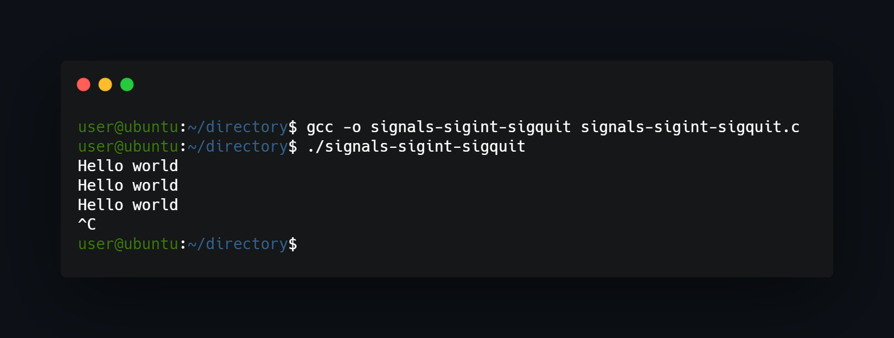

## What project do?
___
Simple program that prints "Hello world!" in infinite loop, that should be stopped using \<Ctrl+C\> combination (interrupt signal). After that function will be called and after 2 seconds program will stop.



## How to use?
___
Just compile and run:
```
gcc -o signals-sigint-sigquit signals-sigint-sigquit.c 
./signals-sigint-sigquit 
```


<!--https://banner.godori.dev/ height:150-->
<!--https://shields.io/-->
<!--https://carbon.now.sh/-->